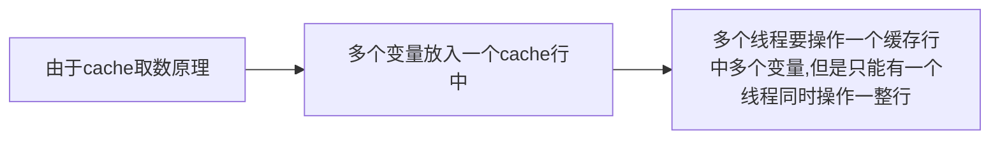

# 并发其他基础知识

## 并发和并行

并发：同一个时间段内，多个任务同时执行，并且没有执行结束

并行：单位时间内，多个任务同时执行

并发强调的是同一个时间段内，是由多个单位时间累积而成。即在这个时间段某一个单位时间运行，某一单位时间没有运行，微观上，并没有同时运行。

## 线程安全问题

**资源共享：**某个资源被多个线程共同持有，多个线程可以共同访问

由于资源共享，多个线程会同时访问、操作这个资源，这就导致某次操作时候，线程a对共享资源进行修改，但是修改后还没有保存到内存，就被阻塞挂起，线程b对资源修改后，线程a进行没有完成的任务，就会导致资源保存出现问题。

## 共享变量的内存可见性问题


Java内存模型如图所示，所有的变量都会放在主内存中，每个线程对主内存中的共享变量进行操作时候，会先将共享变量复制一份存到自己的**工作内存**中，线程对变量的操作就是对工作内存中的工作内存的变量操作

对于以上的内存模型，就会出现**共享变量的内存可见性问题：**

* 线程A对共享变量x=1进行读取，首先会在工作内存中获取，如果没有命中，就再去主内存（或者cpu的cache2）中寻找，然后存放到线程a的工作区域内，进行修改为x=2，然后存放到工作区域，刷新到主内存中
* 同理线程B对x=2进行读取，修改为x=3，刷新，自己的工作内存中为x=3，主内存中也是x=3
* 线程A再想修改共享变量x，就不是再向主内存获取了，因为工作内存中已经命中了，就直接从工作内存获取x=2，而不是主内存中的x=3了

这样就出现问题了，即线程B对共享变量的写入对线程A不可见

## synchronized关键字

### synchronized介绍

synchronized关键字为Java提供的原子性内置锁，线程在进入synchronized代码块前会获取内部锁，这时候其他线程在访问同步代码块时候，会被阻塞挂起。只有拿到**内部锁的线程在执行完毕正常返回**或者**抛出异常后**或者在**同步代码块中调用wait系列方法**后才会释放内置锁。

由于synchronized使用会导致阻塞线程，从而导致线程的上下文切换，所以是个很耗时的操作

### synchronized内存语义

对于进入synchronized块内存语义（也是加锁的语义），就是把代码块中的共享变量从线程的工作内存中清除，这样就让线程取变量永远是从主线程中取；

同理，退出synchronized块的语义（也是释放锁的语义），就是将代码块中的共享变量直接存储到修改刷新到主内存中


## volatile 关键字

该关键字确保了对修饰变量的更新对其他线程马上可见。线程在写入变量时，不会把变量写入工作内存，而是直接刷新修改到主内存；读取变量时，也不会从工作内存中读出，也是从主内存中读出

线程写入volatile变量时，就等价于退出synchronized代码（将共享变量存入到主内存中）；线程读取volatile变量时，就等价于进入synchronized代码块（先清空本地工作内存变量，将共享变量从主内存中读取）


对于volatile关键字和synchronized关键字：

* 都是解决了共享变量内存可见性问题
* 但是synchronized关键字实现的是通过独占锁，同时只能一个线程对共享变量进行操作，这样会导致线程的上下问题切换
* volatile是非阻塞算法，不会导致上下文切换问题，尽管提供可见性保障，但不能保证操作原子性，就无法保证线程安全


## 原子性操作

**原子性操作**，是指执行一系列操作时候，要么全部执行，要么全部不执行，不能执行一部分

````java
public class ThreadNotSafeCount {
    
    private long value;
    
    public synchronized long getValue() {
        return value;
    }
    
    public synchronized inc() {
        value++;
    }
}
````

上述代码中，`inc()`方法是如果没有synchronized关键字修饰，就会导致线程安全问题，但是由于`getValue()`方法只是进行共享变量的读取，理论上可以不使用synchronized关键字修饰，但是synchronized关键字在这里不仅是保证线程安全问题，还是保证了内存可见性，防止线程读取的是本地工作内存中的变量。

## CAS 操作

看这个博客：http://objcoding.com/2018/11/29/cas/

CAS即 Compare and Swap，是JDK提供的<font color=red>**非阻塞原子性操作**</font>，它通过硬件保证了**比较——更新**操作的原子性。

<font color=red>注意：正是因为CAS操作具有非阻塞原子性，就不可能存在CAS执行过程中线程被阻塞挂起</font>

CAS 的思想很简单：**三个参数，一个当前内存值 V、旧的预期值 A、即将更新的值 B，当且仅当预期值 A 和内存值 V 相同时，将内存值修改为 B 并返回 true，否则什么都不做，并返回 false**。

**博客中的举例分析**

> 举例分析：
>
> 1. 设定 AtomicInteger 的 value 原始值为 A，从 Java 内存模型得知，线程 1 和线程 2 各自持有一份 value 的副本，值都是 A。
> 2. 线程 1 通过`getIntVolatile(var1, var2)`拿到 value 值 A，这时线程 1 被挂起。
> 3. 线程 2 也通过`getIntVolatile(var1, var2)`方法获取到 value 值 A，并执行`compareAndSwapInt`方法比较内存值也为 A，成功修改内存值为 B。
> 4. 这时线程 1 恢复执行`compareAndSwapInt`方法比较，发现自己手里的值 A 和内存的值 B 不一致，说明该值已经被其它线程提前修改过了。
> 5. 线程 1 重新执行`getIntVolatile(var1, var2)`再次获取 value 值，因为变量 value 被 volatile 修饰，所以其它线程对它的修改，线程 A 总是能够看到，线程A继续执行`compareAndSwapInt`进行比较替换，直到成功。

对于这个例子，可以这样理解：

两个线程同时对内存中的共享变量进行操作，线程A获取到变量的副本后，还没来得及操作，被阻塞挂起，线程B也获得这个变量的副本，并通过`compareAndSwapInt`方法进行修改，并刷新到。修改完成后，A线程运行，准备修改时，也是要通过`compareAndSwapInt`方法修改，但是发现返回是false，即之前有线程对内存中的变量进行修改了，那么线程A就进行自旋，再次尝试从内存中获取变量新值（由于这个变量是volatile修饰的，是具有内存可见性，那么获取变量新值，然后再次尝试进行`compareAndSwapInt`方法，直到成功为止

从这里可以看出，CAS是只对内存中变量关心，不关心之前是怎么修改的（过程），即只要是和线程中变量副本值相同就是可以进行修改的。这就引出了CAS的ABA问题：

> 例如线程 1 从内存位置 V 取出 A，这时候线程 2 也从内存位置 V 取出 A，此时线程 1 处于挂起状态，线程 2 将位置 V 的值改成 B，最后再改成 A，这时候线程 1 再执行，发现位置 V 的值没有变化，尽管线程 1 也更改成功了，但是不代表这个过程就是没有问题的。
>
> 例如：
>
> 现有一个用单向链表实现的栈，栈顶元素为 A，A.next 为 B，期望用 CAS 将栈顶替换成 B。
>
> 有线程 1 获取了元素 A，此时线程 1 被挂起，线程 2 也获取了元素 A，并将 A、B 出栈，再 push D、C、A，这时线程 1 恢复执行 CAS，因为此时栈顶元素依然为 A，线程 1 执行成功，栈顶元素变成了 B，但 B.next 为 null，这就会导致 C、D 被丢掉了。


这个博客对CAS进行了详细解释 https://blog.nowcoder.net/n/3f413b4af088415baafc159591a1a411

**CAS非阻塞原因：**

> 当多个线程同时使用CAS 操作一个变量时，只有一个会胜出，并成功更新，其余均会失败。失败的线程不会挂起，仅是被告知失败，并且允许再次尝试，当然也允许实现的线程放弃操作。**基于这样的原理，CAs操作即使没有锁，也可以发现其他线程对当前线程的干扰**。

## Unsafe类 （没仔细了解）


## Java指令重排序

Java内存模型允许编译器和处理器对指令重排序以提高运行性能，并且只对**不存在数据依赖的指令**重排序。单线程下重排序可以保证最终执行结果与程序顺序执行的结果一致，但是多线程下就会出现问题

重排序在多线程下会导致非预期的程序执行结果，而是用volatile修饰就会避免重排序。

> 写volatile变量时，可以却表volatile写之前操作不会被编译器重排到volatile写之后。读volatile变量时，可以确保volatile读之后操作不会被编译器重排到volatile读之前。

保证读写顺序是根据原来代码进行的，而不是重排序后进行的


## 伪共享

### 什么是伪共享

cache存放数据的行是可以存放多个变量的。当多个线程同时修改一个cache行中的多个变量时候，由于只能有一个线程对行进行操作，相比于每个行都有只有一个变量，性能会下降，这就是伪共享。



对于连续地址，多个变量被放入同一个缓存行，单线程访问对性能是有益的，但是对于多线程，还是有性能影响的

### 如何避免伪共享

JDK8之前，是使用字节填充的方式解决问题，即创建一个变量时使用填充字段填充改变量所在的缓存行，JDK8通过sun.misc.Sontented注释，用来解决伪共享问题


## 锁

### 悲观锁和乐观锁

悲观锁是指对数据被外界修改持有保守态度，认为数据很容易被其他线程修改，所以在数据处理前对数据进行加锁，并在整个数据处理过程中，使数据处于锁定状态。

乐观锁是指认为数据在一般情况下不会造成冲突，所以在访问记录之前不会加排他锁，而是在进行数据提交更新时候，才会正式对数据冲突与否进行检测

乐观锁一般实现有两种：

① 版本号控制

② CAS算法

乐观锁在提交时候，都是采用自旋的方式，如果提交成功，就结束自旋，而如果没有提交成功，就继续尝试提交，在尝试多次之后，如果还是不行，就放弃

### 公平锁和非公平锁

根据线程获取锁的抢占机制，锁分为公平锁和非公平锁

公平锁：线程锁的获取顺序是根据请求锁的时间顺序决定，早来早获取

非公平锁：线程锁的获取则是抢占式的，一般也是都使用这种锁

### 独占锁和共享锁

根据锁只能被一个线程持有还是多个线程共同持有，分为独占锁和共享锁

独占锁是悲观锁、共享锁是乐观锁

### 可重入锁

当一个线程持有锁，其他访问锁，会被阻塞。但是本线程持有锁，本线程在持有锁的时间里，再次访问该锁，如果不被阻塞，就是可重入锁

synchronized就是可重入锁。可重入锁原理就是在锁内维护一个线程标示，用来标示目前锁被哪个线程所持有，然后关联一个计数器。只有当这个锁被标示线程访问，计数器就会+1，当计数器为0，线程标示重置为null，阻塞线程会被唤醒竞争锁。释放锁的时候计数器为-1.

### 自旋锁

当线程在获取锁失败后，会被切换到内核状态而被挂起。当线程获取到锁时，有需要将其切换到内核状态而唤醒线程，这样对性能开销大。自旋锁则是，在当前线程尝试获取锁时候，如果发现锁已经被其他线程持有，他不会马上阻塞自己，而是在不放弃cpu使用权情况下，多次尝试获取。尝试几次失败后，才会被阻塞挂起。